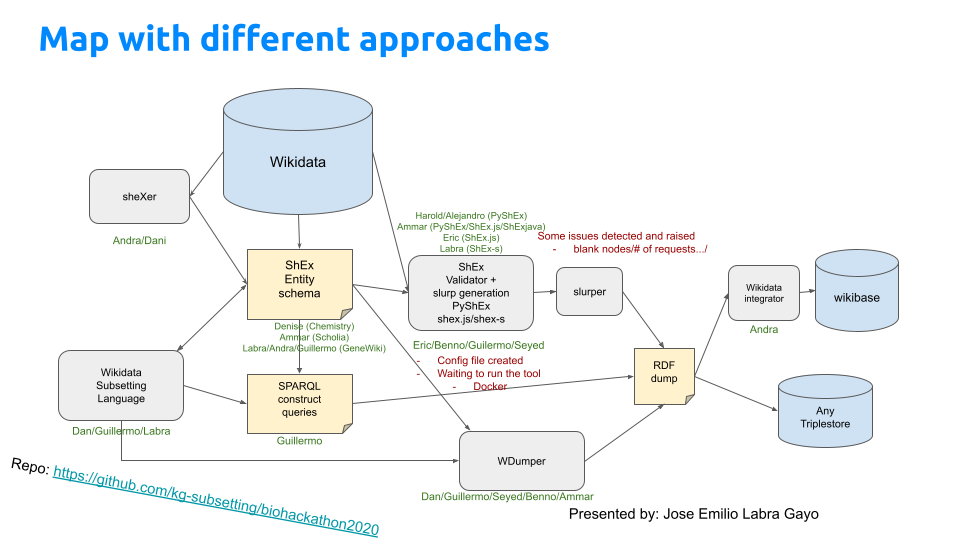

<!--

The paper.md, bibtex and figure file can be found in this repo:

  https://github.com/kg-subsetting/preprint-biohackrxiv

-->

# Introduction

- Short sentence about Knowledge graphs and wikidata. 
- Talk about entity schemas at Wikidata which are based on ShEx [@EricSemantics2014]

## Motivation

TODO

## Use cases

# Description of different approaches and pipeline

## Describing the subsets

- Using Entity schemas created manually
- Generating entity schemas from instance data

## Wikidata subsetting language

- TODO: Describe the idea...
- Generates SPARQL Construct queries

# Extraction of subsets from wikidata

## Slurping 

## WDumper

# Creating the subset

- Transforming and enriching the RDF dump using schema.org
- WikidataIntegrator

# Discussion

TODO: Review...

- Talk about docker image
- Future work: Wikidata subsetting as a service?

# Conclusions

# References
